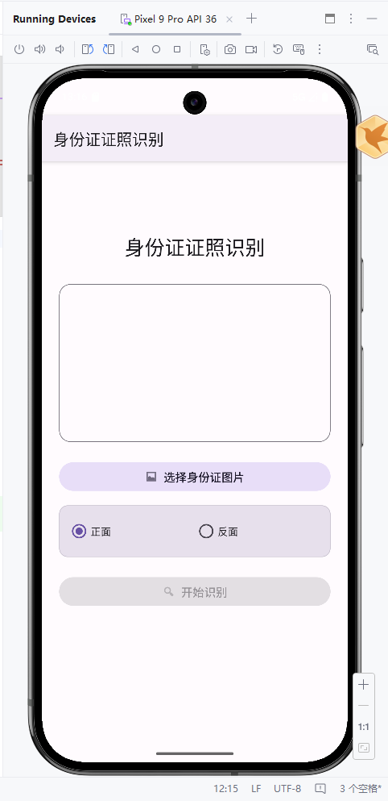

# 身份证证照识别 Android 应用

## 项目概述
本项目是一个基于腾讯云OCR服务的Android身份证识别应用，用户可以通过拍照或选择相册中的身份证图片，自动识别并提取身份证上的信息。

## 2.1 业务流程分析说明

### 功能描述
本应用实现了以下核心功能：
1. **图片选择**：用户可以从相册中选择身份证照片
2. **正反面选择**：支持识别身份证正面和反面
3. **OCR识别**：调用腾讯云OCR API进行身份证信息识别
4. **结果展示**：将识别结果以结构化方式展示给用户

### 基本技术
- **开发语言**：Kotlin
- **最低SDK版本**：24 (Android 7.0)
- **目标SDK版本**：35 (Android 15)
- **网络框架**：HttpURLConnection（Android原生）
- **异步处理**：Kotlin Coroutines
- **图片处理**：Android原生Bitmap API

### 业务流程
```
用户启动应用
  ↓
选择身份证图片
  ↓
选择正面/反面
  ↓
点击"开始识别"
  ↓
图片转Base64编码
  ↓
生成腾讯云V3签名
  ↓
发送HTTP POST请求
  ↓
接收并解析响应
  ↓
展示识别结果
```

## 2.2 基本页面设计

### UI设计风格
本应用采用 **Google Material 3 (Material You)** 设计系统，提供现代化、个性化的用户界面体验。

#### Material 3 特性
- **动态配色系统**：支持浅色/深色主题自动切换
- **圆角设计**：16dp圆角卡片，更柔和的视觉效果
- **无阴影设计**：使用描边代替阴影，更加扁平化
- **Material 组件**：使用最新的 Material 3 组件库

### 主界面 (MainActivity)
- **标题**：使用 Material 3 排版系统显示"身份证证照识别"
- **图片预览区**：使用 MaterialCardView 包裹，16dp圆角，描边样式
- **选择图片按钮**：MaterialButton (Tonal样式)，带图标
- **正反面选择**：MaterialRadioButton，使用卡片背景突出显示
- **开始识别按钮**：MaterialButton (Filled样式)，带图标
- **进度条**：Material 3 CircularProgressIndicator

### 结果展示界面 (ResultActivity)
- **标题**：使用 Material 3 排版系统显示"识别结果"
- **结果卡片**：使用 MaterialCardView，描边样式，展示识别结果
- **动态内容区**：根据识别结果动态添加字段，使用 Material 主题颜色
- **返回按钮**：MaterialButton (Tonal样式)，带图标

### 采集的数据内容与格式

#### 身份证正面信息
- 姓名 (Name)
- 性别 (Sex)
- 民族 (Nation)
- 出生日期 (Birth)
- 住址 (Address)
- 身份证号 (IdNum)

#### 身份证反面信息
- 签发机关 (Authority)
- 有效期限 (ValidDate)

## 2.3 功能模块说明与核心代码

### 2.3.1 HttpURLConnection网络编程框架

#### 特性
HttpURLConnection是Android平台提供的标准HTTP客户端，具有以下特性：
1. **轻量级**：无需引入第三方依赖，减小APK体积
2. **原生支持**：Android系统原生支持，兼容性好
3. **灵活性**：支持GET、POST等多种HTTP方法
4. **可配置**：可设置超时时间、请求头等参数
5. **流式处理**：支持输入输出流，适合大文件传输

#### 基本使用方法
```kotlin
// 1. 创建URL对象
val url = URL("https://api.example.com")

// 2. 打开连接
val connection = url.openConnection() as HttpURLConnection

// 3. 配置连接参数
connection.requestMethod = "POST"
connection.connectTimeout = 15000
connection.readTimeout = 15000
connection.doOutput = true
connection.doInput = true

// 4. 设置请求头
connection.setRequestProperty("Content-Type", "application/json")

// 5. 写入请求体
OutputStreamWriter(connection.outputStream).use { writer ->
    writer.write(requestBody)
    writer.flush()
}

// 6. 读取响应
val responseCode = connection.responseCode
val response = BufferedReader(InputStreamReader(connection.inputStream)).use {
    it.readText()
}

// 7. 关闭连接
connection.disconnect()
```

### 2.3.2 核心代码模块

#### 1. 腾讯云V3签名算法 (TencentCloudSignature.kt)

**功能说明**：实现腾讯云API V3版本的签名算法，用于身份验证。

**核心代码**：
```kotlin
fun generateSignature(
    secretId: String,
    secretKey: String,
    service: String,
    host: String,
    action: String,
    payload: String,
    timestamp: Long
): Map<String, String> {
    // 1. 拼接规范请求串
    val canonicalRequest = "$httpRequestMethod\\n$canonicalUri\\n$canonicalQueryString\\n" +
            "$canonicalHeaders\\n$signedHeaders\\n$hashedRequestPayload"

    // 2. 拼接待签名字符串
    val stringToSign = "$ALGORITHM\\n$timestamp\\n$credentialScope\\n$hashedCanonicalRequest"

    // 3. 计算签名（使用HMAC-SHA256）
    val secretDate = hmacSha256(date.toByteArray(), "TC3$secretKey".toByteArray())
    val secretService = hmacSha256(service.toByteArray(), secretDate)
    val secretSigning = hmacSha256("tc3_request".toByteArray(), secretService)
    val signature = hmacSha256Hex(stringToSign.toByteArray(), secretSigning)

    // 4. 拼接Authorization头
    val authorization = "$ALGORITHM Credential=$secretId/$credentialScope, " +
            "SignedHeaders=$signedHeaders, Signature=$signature"

    return mapOf("Authorization" to authorization, ...)
}
```

**安全说明**：
- SecretId和SecretKey需要从腾讯云控制台获取
- 在实际部署时，应将密钥存储在服务器端，避免在客户端暴露
- 本示例中的密钥已做脱敏处理，需替换为真实密钥

#### 2. HTTP网络请求工具 (HttpUtil.kt)

**功能说明**：封装HttpURLConnection，提供简洁的POST请求接口。

**核心代码**：
```kotlin
fun post(urlString: String, headers: Map<String, String>, body: String): String {
    val url = URL(urlString)
    val connection = url.openConnection() as HttpURLConnection

    connection.requestMethod = "POST"
    connection.connectTimeout = 15000
    connection.readTimeout = 15000

    // 设置请求头
    headers.forEach { (key, value) ->
        connection.setRequestProperty(key, value)
    }

    // 写入请求体
    OutputStreamWriter(connection.outputStream, StandardCharsets.UTF_8).use { writer ->
        writer.write(body)
        writer.flush()
    }

    // 读取响应
    val response = BufferedReader(InputStreamReader(connection.inputStream)).use {
        it.readText()
    }

    connection.disconnect()
    return response
}
```

#### 3. OCR服务封装 (TencentOCRService.kt)

**功能说明**：封装腾讯云身份证识别API调用逻辑。

**核心代码**：
```kotlin
suspend fun recognizeIDCard(imageBase64: String, cardSide: String): String {
    return withContext(Dispatchers.IO) {
        val timestamp = System.currentTimeMillis() / 1000

        // 构建请求体
        val payload = JSONObject().apply {
            put("ImageBase64", imageBase64)
            put("CardSide", cardSide)
        }.toString()

        // 生成签名
        val headers = TencentCloudSignature.generateSignature(
            secretId = SECRET_ID,
            secretKey = SECRET_KEY,
            service = "ocr",
            host = "ocr.tencentcloudapi.com",
            action = "IDCardOCR",
            payload = payload,
            timestamp = timestamp
        )

        // 发送请求
        HttpUtil.post("https://ocr.tencentcloudapi.com", headers, payload)
    }
}
```

#### 4. 图片处理工具 (ImageUtil.kt)

**功能说明**：将图片转换为Base64编码，并进行压缩优化。

**核心代码**：
```kotlin
fun uriToBase64(context: Context, uri: Uri, maxSize: Int = 1024): String {
    // 1. 读取图片并计算缩放比例
    val options = BitmapFactory.Options().apply {
        inJustDecodeBounds = true
    }
    var scale = 1
    while (options.outWidth / scale > maxSize || options.outHeight / scale > maxSize) {
        scale *= 2
    }

    // 2. 按比例解码图片
    val bitmap = BitmapFactory.decodeStream(inputStream, null, options2)

    // 3. 压缩为JPEG并转Base64
    val outputStream = ByteArrayOutputStream()
    bitmap.compress(Bitmap.CompressFormat.JPEG, 85, outputStream)
    return Base64.encodeToString(outputStream.toByteArray(), Base64.NO_WRAP)
}
```

#### 5. 主界面逻辑 (MainActivity.kt)

**功能说明**：处理用户交互，协调各模块完成识别流程。

**核心代码**：
```kotlin
private fun recognizeIDCard() {
    lifecycleScope.launch {
        try {
            // 1. 图片转Base64
            val imageBase64 = ImageUtil.uriToBase64(this@MainActivity, uri)

            // 2. 确定正反面
            val cardSide = if (radioFront.isChecked) "FRONT" else "BACK"

            // 3. 调用OCR识别
            val response = TencentOCRService.recognizeIDCard(imageBase64, cardSide)

            // 4. 解析结果
            val result = TencentOCRService.parseIDCardResult(response)

            // 5. 跳转结果页面
            val intent = Intent(this@MainActivity, ResultActivity::class.java)
            intent.putExtra("result", HashMap(result))
            startActivity(intent)
        } catch (e: Exception) {
            Toast.makeText(this@MainActivity, "识别失败: ${e.message}", Toast.LENGTH_LONG).show()
        }
    }
}
```

#### 6. 结果展示逻辑 (ResultActivity.kt)

**功能说明**：动态展示识别结果。

**核心代码**：
```kotlin
private fun displayResult() {
    val result = intent.getSerializableExtra("result") as? HashMap<String, String>

    result?.forEach { (key, value) ->
        addResultItem(key, value)
    }
}

private fun addResultItem(label: String, value: String) {
    val labelView = TextView(this).apply {
        text = "$label："
        textSize = 16f
    }
    val valueView = TextView(this).apply {
        text = value
        textSize = 18f
    }
    resultContainer.addView(labelView)
    resultContainer.addView(valueView)
}
```

## 2.4 系统结果及分析

### 使用说明

1. **配置密钥**：
   - 打开 `TencentOCRService.kt`
   - 将 `SECRET_ID` 和 `SECRET_KEY` 替换为您的腾讯云密钥
   - 密钥获取地址：https://console.cloud.tencent.com/cam/capi

2. **运行应用**：
   ```bash
   ./gradlew assembleDebug
   adb install app/build/outputs/apk/debug/app-debug.apk
   ```

3. **测试流程**：
   - 启动应用
   - 点击"选择身份证图片"
   - 从相册选择身份证照片
   - 选择正面或反面
   - 点击"开始识别"
   - 查看识别结果

### 主要问题及解决方法

#### 问题1：网络请求在主线程执行导致ANR
**解决方法**：使用Kotlin Coroutines将网络请求放在IO线程执行
```kotlin
lifecycleScope.launch {
    withContext(Dispatchers.IO) {
        // 网络请求代码
    }
}
```

#### 问题2：图片过大导致内存溢出
**解决方法**：在解码前计算缩放比例，按需加载
```kotlin
val options = BitmapFactory.Options().apply {
    inSampleSize = scale  // 缩放比例
}
```

#### 问题3：Android 13权限适配
**解决方法**：根据系统版本请求不同的权限
```kotlin
if (Build.VERSION.SDK_INT >= Build.VERSION_CODES.TIRAMISU) {
    // 使用READ_MEDIA_IMAGES
} else {
    // 使用READ_EXTERNAL_STORAGE
}
```

#### 问题4：签名算法实现复杂
**解决方法**：严格按照腾讯云V3签名文档实现，注意字符编码和时间格式

### 开发体会

1. **网络框架选择**：HttpURLConnection虽然原生，但使用较为繁琐，对于复杂项目建议使用OkHttp或Retrofit
2. **异步处理**：Kotlin Coroutines大大简化了异步代码的编写，避免了回调地狱
3. **安全性**：密钥不应硬编码在客户端，实际项目应通过服务器中转API调用
4. **用户体验**：添加加载动画和错误提示，提升用户体验
5. **代码复用**：将通用功能封装为工具类，提高代码可维护性

### 项目结构
```
app/src/main/java/com/project/demo/
├── activity/
│   ├── MainActivity.kt          # 主界面
│   └── ResultActivity.kt        # 结果展示界面
└── utils/
    ├── TencentCloudSignature.kt # 腾讯云V3签名
    ├── HttpUtil.kt              # HTTP请求工具
    ├── TencentOCRService.kt     # OCR服务封装
    └── ImageUtil.kt             # 图片处理工具
```

### 技术亮点

1. **完整的V3签名实现**：严格按照腾讯云规范实现签名算法
2. **模块化设计**：各功能模块职责清晰，易于维护和扩展
3. **现代化技术栈**：使用Kotlin + Coroutines，代码简洁高效
4. **Material 3 设计**：采用最新的 Google Material You 设计系统
5. **良好的用户体验**：权限处理、加载状态、错误提示完善
6. **原生网络框架**：使用HttpURLConnection，无第三方依赖

### API文档参考
- 腾讯云OCR API：https://cloud.tencent.com/document/product/866/33524
- 腾讯云V3签名：https://cloud.tencent.com/document/api/866/33518

### 运行截图

